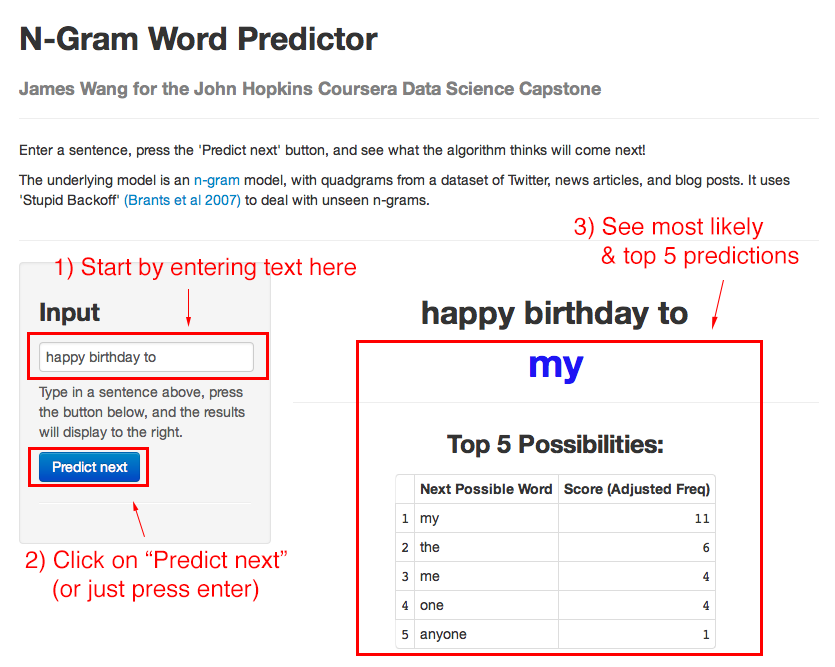
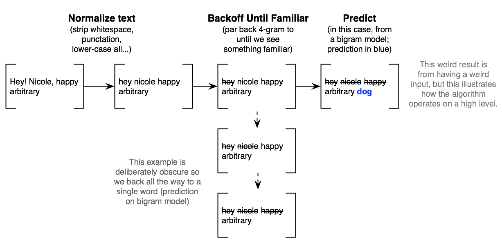

N-Gram Word Predictor: Data Science Capstone
========================================================
author: James Wang
date: December 14, 2014

Overview
========================================================

If you haven't tried out the app, go [here](https://j-wang.shinyapps.io/ngram_predictor/) to try it!

- Predicts next word
- Shows you top 5 other possibilities
- Can be used to string together continuous, sensible sentences (even with the limited amount of data it's using now)

How To Use the App
========================================================

Underlying Algorithm
========================================================

- N-gram model with "Stupid Backoff" ([Brants et al 2007](http://www.cs.columbia.edu/~smaskey/CS6998-0412/supportmaterial/langmodel_mapreduce.pdf))
- Checks if highest-order (in this case, n=4) n-gram has been seen. If not "degrades" to a lower-order model (n=3, 2); we would use even higher orders, but ShinyApps caps app size at 100mb

Blazing Fast and Scaleable
========================================================

- The underlying code stores the n-gram and frequency tables in an SQLite database. N-gram queries use SQL, which is
optimized for this type of table retrieval/lookup (can also be adapted for even larger production-scale databases
like PostgreSQL)
- "Stupid Backoff" is designed for scale. We're restricted to 100mb on ShinyApps, but the 
[original paper](http://www.cs.columbia.edu/~smaskey/CS6998-0412/supportmaterial/langmodel_mapreduce.pdf)
trained on 2 trillion tokens
- Stupid Backoff performance approaches more sophisticated models like Kneser-Ney as we increase amount of data
    - Here, we merely use 1.5% of the data provided by SwiftKey and Coursera to fit into the 100mb limit

Further Exploration
========================================================

- The code (for processing into a database and prediction) is available on GitHub
- Further work can expand the main weakness of this approach: long-range context
    1. Current algorithm discards contextual information past 4-grams
    2. We can incorporate this into future work through clustering underlying training corpus/data and predicting what cluster the entire sentence would fall into
    3. This allows us to predict using ONLY the data subset that fits the long-range context of the sentence, while still preserving the performance characteristics of an n-gram and Stupid Backoff model
